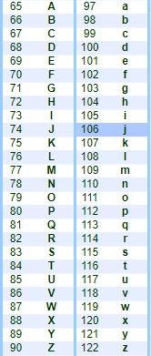
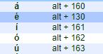
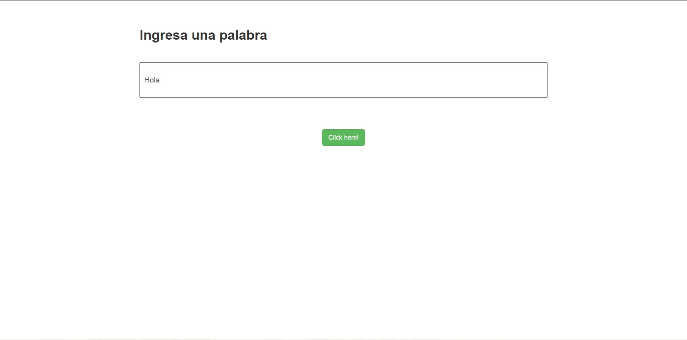
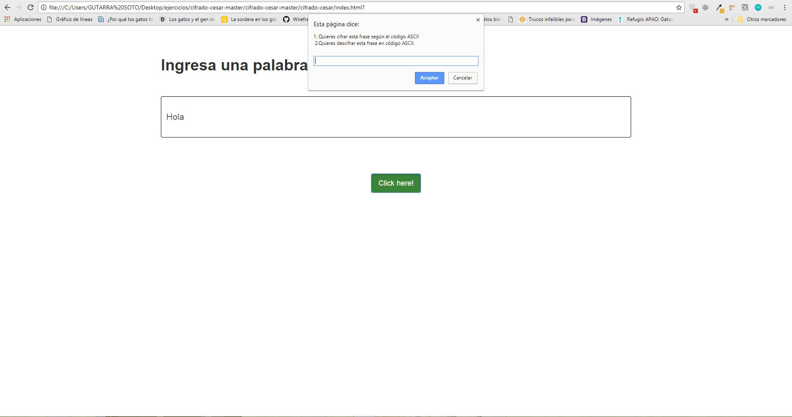
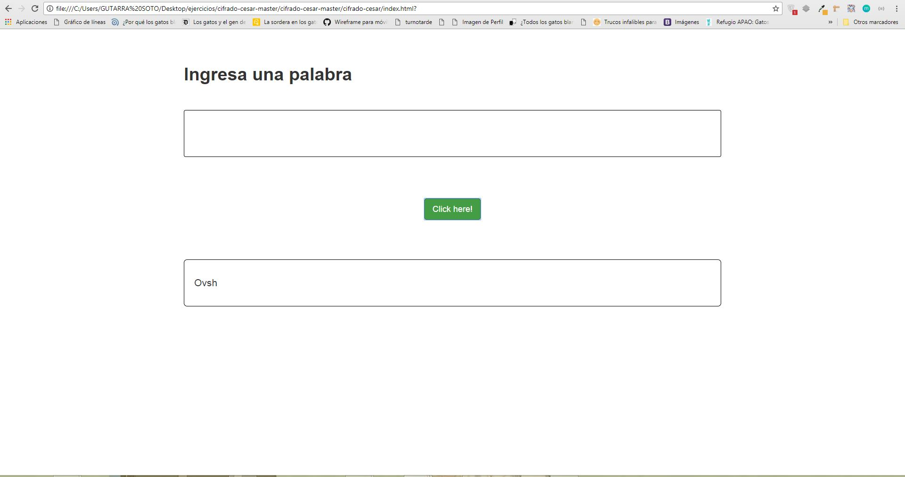
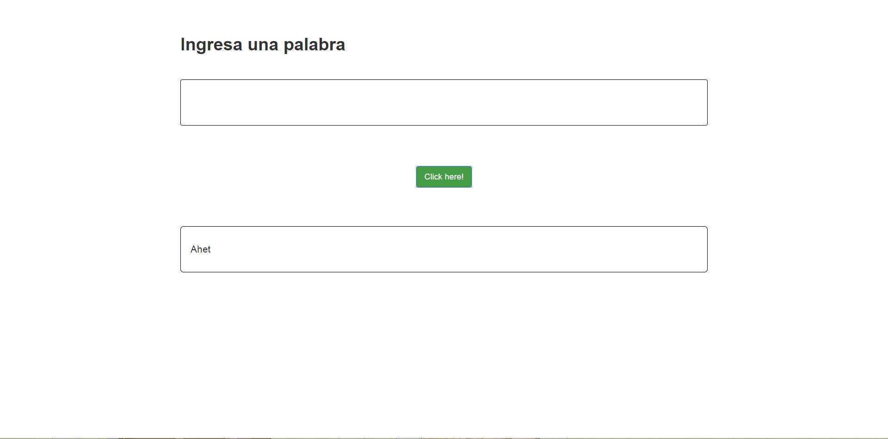

# **Producto final 1 - Cifrado César**

----------------------------------------------------------------------------------------

[](http://forthebadge.com)
[](http://forthebadge.com)
[](http://forthebadge.com)
[](http://forthebadge.com)
[](http://forthebadge.com)
[](http://forthebadge.com)


## **Objetivo**

El objetivo de este trabajo es crear una web donde el usuario escriba en un área de texto una frase en mayúscula o minúscula y que la devuelva encriptada según el algoritmo de Cifrado César con el parámetro de desplazamiento de 33 espacios hacia la derecha.


## **Herramientas Tecnológicas Aplicadas**

* HTML5

* Javascript(estándar ECMAScript 6)

* Librería de Javascript jQuery

* CSS3

* Bootstrap

* Código ASCII

## **Restricciones**

* Esta aplicación acepta letras, es decir no se puede escribir:

  * números.

  * Signos de puntuación, interrogación o exclamación.

* Asimismo no introduzca palabras con tilde, ya que el algoritmo de Luhn empleado solo puedo cifrar y descifrar, gracias al código ASCII, palabras compuestas pòr las 27 letras del abecedario(no incluye ch, ñ, etc.).



* Las vocales con tilde tienen un diferente código ASCII(ignorar el ```alt +```).



* No hay restricciones al introducir una palabra compuesta por letras mayúsculas y minúsculas.

## **Flujo de la Aplicación**

* El usuario escribe una frase en el formulario.



* Hace click al botón ```Click Me``` y le aparece una alerta con dos opciones: una para cifrar la frase(```opción 1```) y otra para descifrarla(```opción 2```).



* Si escoge la primera opción, entonces le aparece un área de texto con la frase cifrada(```Hola ---> Ovsh```).



* Si escoge la segunda opción, le aparece un un área de texto con la frase descifrada(```Hola ---> Ahet```).



* El área de texto donde el usuario introdujo la frase se limpia para que pueda repetir el proceso cuantas veces quiera.
