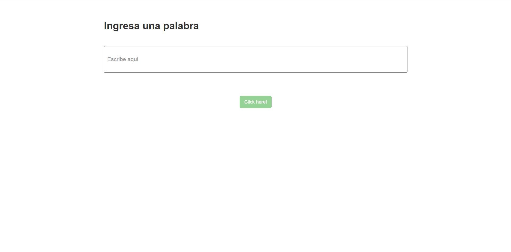

# **Producto final 1 - Cifrado César**

----------------------------------------------------------------------------------------

## **Objetivo**

El objetivo de este trabajo es crear una web donde el usuario escriba en un formulario una frase y devuelva el mismo mensaje encriptado según el algoritmo de Cifrado César con el parámetro de desplazamiento de 33 espacios hacia la derecha.

## **Herramientas Tecnológicas Aplicadas**

* HTML5

* Javascript(estándar ECMAScript 6)

* Librería de Javascript jQuery

* CSS3

* Bootstrap

## **Restricciones**

* El algoritmo solo descifra palabras, no números.

## **Flujo de la Aplicación**

* El usuario escribe una frase en el formulario.

* Hace click al botón Click Me.

* Le aparece una alerta con dos opciones: una para cifrar la frase y otra para descifrarla.

* Si escoge la primera opción(cifrado de la frase), entonces le aparece un caja/contenedor con la frase cifrada.

* Si escoge la segunda opción(descifrado de la frase), también le aparece un caja/contenedor pero con la frase descifrada.

* El usuario puede repetir el proceso cuantas veces quiera.
